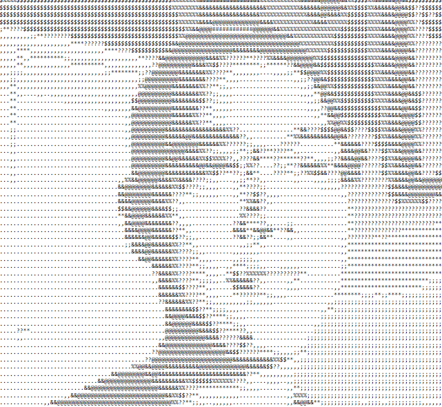

<table>
<tr>
<td>

<h1>Max Sun</h1>

<strong>Student interested in Software, ML &amp; Chip Design</strong>

</td>
<td>

</td>
</tr>
</table>

## Work
Built a Python-based financial automation system for the Birdfeeder, a concessions business at Cincinnati Country Day School. The application ingests Square API transaction data, calculates revenue, cost of goods sold, processing fees, and net income, and generates KPI dashboards for business analysts. Used by the Birdfeeder to automate financial reporting workflows.

[Financial Automation for the Birdfeeder](https://github.com/Max-sm-yc/BirdfeederFinancialData)

## Tech Stack
Languages:
Python, C++, Java

Libraries & Frameworks:
PyTorch, CUDA C++, LangChain

Tools:
Git, Github, VSCode

Concepts:
OOP, Data Structures, Transformers, AI Agents, RAG, GPU Programming

## Projects

[RAG Pipeline with Jev (TypeScript AI)](https://github.com/Max-sm-yc/Jev-RAG)

A RAG Pipeline for document search that uses Jev for re-ranking. Performs 70% faster and 72% cheaper on the same prompt vs using the output model for re-ranking.

[Artifact Chat Agent](https://github.com/Max-sm-yc/artifact-agent)

Created an agentic chatbot capable of modifying code and text outputs without needing to regenerate entire sequences. The agent creates, modifies, copies artifacts, preventing transcription mistakes that standard chat interfaces can introduce.

[Gated Convolution Kernel (CUDA/CUTLASS)](https://github.com/Max-sm-yc/ConvolutionGate)

Developed a custom CUDA implementation of a Gated Convolution kernel using CUTLASS that outperformed PyTorch eager execution and torch.compile on medium-length workloads. Peak outperformance of 42% vs torch.compile and 67.6% vs PyTorch eager. 

### Foundational Projects

[Tensor C++](https://github.com/Max-sm-yc/tensorcpp)

A project recreating deep learning functionalities in C++. Intended to be executed on CPU (SIMD Hardware). All dimensions must be multiples of 8 for SIMD execution.

Features: tensor matadd matmul linear

[Vector Database & Search (C++)](https://github.com/Max-sm-yc/embeddingDB)

A C++ embedding database that allows vector insertion and search. Searching is conducted by cosine similarity (handled by normalizing all vectors inserted in to the database and finding the dot product). A min heap is used to preserve the top k tokens that are returned.

fillDB creates a vectors.bin with random character combinations and embedding vectors. main ingests data in vectors.bin, conducts a search (and can be modified to insert new embeddings) before writing data back into vectors.bin

## Awards and Programs

• Leaf Course AI Safety Cohort (Summer 2026, ~10% acceptance rate)
• Citadel Securities High School Terminal Competition:
  Team placed 7th of 29
• HiMCM Meritorious

## Education

Cincinnati Country Day School
High School Senior | GPA: 4.0

• Highest weighted GPA in class for three years
• SAT: 1570 (800 Math, 770 EBRW)
• Coursework: Linear Algebra, Differential Equations,
  AP Calculus BC, AP Computer Science A

## [Resume](https://raw.githubusercontent.com/Max-sm-yc/max-sm-yc.github.io/main/MaxResume.pdf)

## Contact
Email: max-sm-yc@gmail.com
